# Doom3 GUIs and dhewm3's Extensions

Doom3 supports creating GUIs in their own scripting language.  
They're used for menus like the main menu or the PDA, for the HUD and also for the interactive
(and sometimes non-interactive) user interfaces you see in the game itself.

iddevnet has an introduction to Doom3 GUIs: https://iddevnet.dhewm3.org/doom3/guis.html
The ModWiki has more information, see https://modwiki.dhewm3.org/GUI_scripting and the linked pages.  
Apart from this, the .gui files shipped with Doom3 can be used as a reference.

[The DarkMod](https://www.thedarkmod.com) has excellent documentation on GUI scripting in their wiki,
see https://wiki.thedarkmod.com/index.php?title=GUI_Scripting_Language and the articles linked there.
Some of the information found there is specific to The DarkMod (due to their own changes
and enhancements), but a lot of it applies to standard Doom3 and dhewm3 as well, and frankly I haven't
seen any better or more comprehensive documentation of this topic yet.

dhewm3 includes a GUI editor (at least on Windows), but I think it doesn't even support all features
of the original Doom3 GUIs, and it definitely doesn't support dhewm3s extensions. It might however
still be useful to draft your GUI so you can later improve it by editing its script.

Furthermore, you can find some tutorials at:
* https://www.moddb.com/games/doom-iii/tutorials/doom-3-gui-scripting-tutorials
* https://www.moddb.com/games/doom-iii/tutorials/creating-a-new-hud
* https://www.moddb.com/games/doom-iii/tutorials/making-a-loading-screen

The primary purpose of **this article** is to document dhewm3's extensions/improvements to this system.
For this it will also describe some basics, but it is *not* a good introduction to learn GUI scripting,
for that check out the links above.

## Doom3 GUIs

The [iddevnet article](https://iddevnet.dhewm3.org/doom3/guis.html) says

> After working with the Doom 3 GUIs a while you will both love and hate them.

That is definitely true. On the one hand, Doom3's GUI system is quite powerful, but on the other
hand it is really verbose (the Doom3 main menu script has over 22 thousand lines of code!) and has
annoying limitations.

The core limitation is that they use a fixed resolution of 640x480 internally, which kinda implies
assuming that players screens have a 4:3 aspect ratio.  
*Side note: On the one hand, hardcoding a 4:3 resolution in 2004 isn't that surprising, as back then
most people had a 4:3 CRT display, or maybe a 5:4 LCD display (close enough to still look ok).
On the other hand, [John Carmack already used a 1920x1080 widescreen display in 1995](https://www.themarysue.com/1995-john-carmack-quake-monitor/)
so he could've known better...*

First some **terminology**:
- **screen:** This will refer to your **actual screen** (and its resolution) if you play in fullscreen mode,
  **or the Doom3 (operating-system-level) window** if you play in windowed mode.  
  So if you play in a 1680x1050 window, the *screen size* (as used in this article) is 1680x1050
  physical pixels, even if your actual screen (display) is 1920x1200 or whatever. I call this
  screen (size) instead of window (size) to avoid confusion between Doom3's window and the windows
  *within* Doom3 that are created with GUI scripts.
- **physical pixel:** One actual pixel on your display. If you play at FullHD resolution, Doom3 has
  1920x1080 physical pixels. GUI scripts are completely unaware of physical pixels.
- **virtual pixel:** (My word for) a virtual pixel within Doom3's 640x480 GUI coordinate system,
  does (usually) not correspond to just one physical pixel. All coordinates and sizes of UI elements
  in Doom3 GUIs are in virtual pixels.
- **ingame GUI:** a GUI in the game, rendered onto ingame geometry, like panels that open doors.
- **fullscreen GUI:** a GUI that's rendered "flatly" on the screen, not within the game world.
  Examples: HUD, main menu, PDA, crosshair
- **menu:** *Interactive* fullscreen GUI like the main menu or the PDA: Unlike *non-interactive*
  fullscreen GUIs (like HUD, crosshair) you get a mouse cursor when they're shown, so you can click things.

640x480 does *not* mean that it's necessarily pixelly: You can use images with higher resolutions and
when the GUI is scaled up for your display, the images (and lines and fonts) are rendered at the
current resolution. And because the GUIs use floats to represent coordinates, you can position GUI
elements at arbitrary (within 640x480 ...) positions like `20.5, 54.321`.

*By the way:* The coordinate `(0, 0)` represents the upper left corner of the Doom3 window (or screen
in fullscreen mode, or ingame display for ingame GUIs), and `(640, 480)` lower right corner.

A `rect` represents a rectangle within the GUI, as `rect x_coordinate, y_coordinate, width, height`,
relative to the parent windowDef.  
So `rect 50, 30.5, 64, 42` is a rectangle that starts at *x coordinate `50`* (fifty virtual pixels to the right,
from the parents upper left corner), *y coordinate `30.5`* (thirty and a half virtual pixels down)
that is *`64` virtual pixels wide* and has a height of *`42` virtual pixels*.

Example:

```c++
// the outer windowDef is always called Desktop.
// all other windowDefs of this .gui file must be within the Desktop.
windowDef Desktop {
    rect 0, 0, 640, 480 // this windowDef fills the whole screen
    backcolor 0.5, 0.5, 0.5, 1 // grey background
    background "gui/grid1" // a simple 2x2 grid texture, resolution 64x64 pixels
    // repeat the texture based on its size and the Desktop size (640x480)
    // => it's repeated 10 times to the right and 7.5 times (480/64) down
    naturalmatscale 1
    
    windowDef Outer {
        // this windowDef starts at virtual pixel coordinate (20, 30)
        // with a size of 300x300 virtual pixels
        rect 20, 30, 300, 300
        backcolor 0, 0, 1, 0.5 // half-translucent blue background
        
        windowDef Inner {
            // this windowDef starts at (global) virtual coordinates (25, 35)
            // (because it's contained in and thus placed relative to Outer)
            // width: 60 virtual pixels, height: 80 virtual pixels
            rect 5, 5, 60, 80
            backcolor 1, 0, 0, 1 // solid red background
        }
    }
}
```
This code results in the following GUI (open with `testGUI guis/example.gui`):
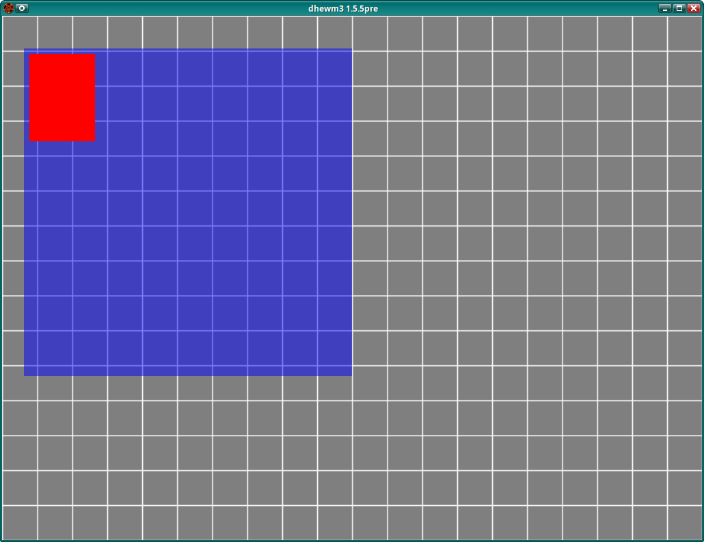

### Ingame User Interfaces

GUIs used ingame like *Super Turbo Turkey Puncher 3*, panels to open doors etc aren't too problematic,
because their size doesn't change, **unlike** user's displays (used to be 4:3, now 16:9 or another
widescreen format) or the Doom3 window size in general, which can be set to any resolution.  

Non-4:3 GUIs in the game are a bit of a PITA, but possible (and easy enough once you know how).
Imagine you want to put an interactive 1:2 (portrait mode) display in your level.

1. Set `rect 0, 0, 240, 480` in your GUI's `windowDef Desktop` and only use that area.
2. In the level editor, create a brush with that aspect ratio (e.g. 64 units high and 32 units wide).
3. On *one* face of that brush, set `textures/common/entityGui`.
4. In the Surface Inspector, click "Fit" and check what values it shows for Horizontal and Vertical
   Scale (e.g. 0.5 and 1).
5. Replace the *Horizontal Scale* value with the value of itself multiplied with `640/240`
  (e.g. `0.5 * 640/240 = 1.333`; I'll explain the value below).
5. Convert the brush to `func_static`.
6. In the Entity Inspector, add key `gui` and value `guis/myingamethingy.gui` (or however you called it).
7. Done!

So, why is the horizontal scale multiplied with `640/240` (2.6667)?

The `entityGui` texture represents a full 640x480 GUI. So if a face is fully covered by that texture
(but only once, without repetitions, like you get when clicking "Fit" in the Surface Inspector),
the whole (virtual 640x480) GUI is shown on the face - and if that face doesn't have a 4:3 aspect ratio,
the GUI will be stretched.

But you want a 1:2 GUI and thus your `windowDef Desktop` only uses 240 of the 640 virtual pixels as
width (`rect 0, 0, 240, 480`), because 480 * 1/2 = 240.  
However, you want these 240/640 virtual pixels to cover the whole face, of course.  
To achieve this, the `entityGui` texture must be stretched accordingly, and **the factor to stretch
240 virtual pixels to 640 virtual pixels is 640/240**. So that's the factor the *Horizontal Scale*
must be multiplied with.

If you instead want a **2:3 GUI**, you'd use `rect 0, 0, 320, 480` (480 * 2/3 = 320) for your Desktop and,
again after fitting the `entityGUI` texture to the face, multiply its *Horizontal Scale* with 320/640.

If on the other hand you want something **wider** than 4:3, you'd mess with the *vertical* sizes instead.
For example, if you want a **16:9 GUI** in the game, you'd use `rect 0, 0, 640, 360`, because you
want to use the full width (640) and instead decrease the height *(otherwise you'd have to reduce 
both width and height, because you can't go higher than 640x480)*.  
Height `360` because *640 * 9/16 = 360* (it's 9/16 instead of 16/9 because this time we're modifying
the vertical resolution).  
In the *Surface Inspector*, you'd again first click *Fit*, but this time you multiply the
_**Vertical** Scale_ and you'd multiply it with *480/360* (the factor to stretch 360 vertical pixels
to 480 vertical pixels).

Note that this should work with Vanilla Doom3 as well.

### Fullscreen GUIs (Menus, HUD)

Fullscreen GUIs like the main menu and the HUD cause more headaches. As mentioned before, Doom3
assumes 4:3 resolutions, so when the screen *(or Doom3 window in windowed mode)* has a widescreen
resolution, the menus get stretched.

The example GUI shown above looks like this on a wide screen:  
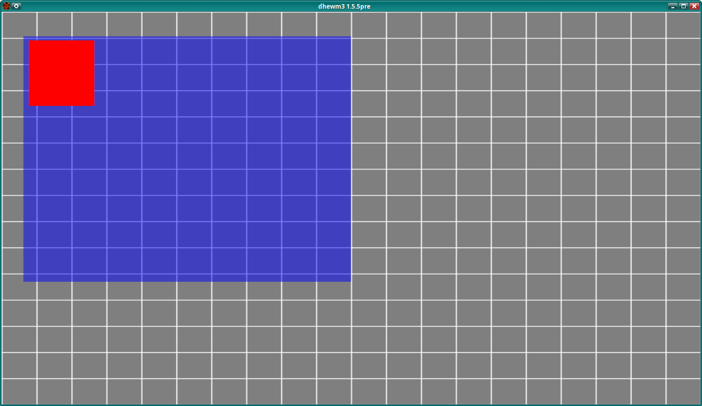  
Note how the background grid is not square and neither is the blue `windowDef`, even though it
has a size of 300x300 virtual pixels.

You can't just create a widescreen GUI by using the trick described for ingame UIs, because you have
no way to tell Doom3 how to scale the GUI - menus always assume 640x480 and if your desktop is
smaller than that, the rest of the screen will remain black (and it is still stretched).  
Besides, your 16:9 widescreen GUI would still only work with 16:9 screens (or windows), not with 4:3
or 32:9, so what's the point...

So with Classic Doom3 you're stuck with 4:3 menus that get stretched to whatever aspect ratio
your screen uses.  
Luckily, dhewm3 has some improvements :)

## dhewm3 Extensions for the Doom3 GUI system

dhewm3 has several features to better support non-4:3 resolutions.

### Scaling of Menus to 4:3 with Letter-Boxing

*dhewm3* scales fullscreen menus like the main menu and the PDA to 4:3 regardless of the resolution,
leaving **black bars on the left and the right**, or if you happen to use a portrait resolution like
9:16, it will have black bars on top and bottom ("Pillar-boxing" or "Letter-boxing").
This feature is controlled with the `r_scaleMenusTo43` CVar: If set to `1` (the default), fullscreen
menus are scaled to 4:3, setting it to `0` restores the old behavior of stretching the menus over
the whole screen.

This is what the example GUI from above looks like when letter-boxed (or actually pillar-boxed):  
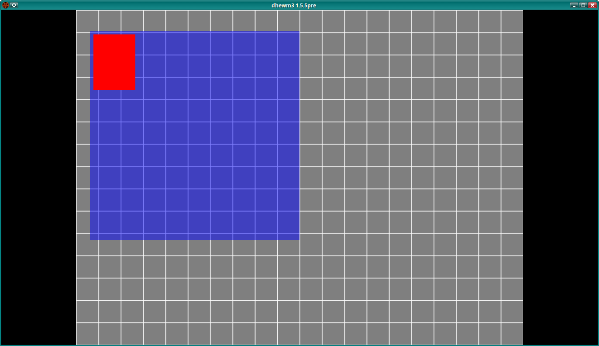  
*Note: The `testGUI` console command does not support letterboxing, I had to replace the main menu
with the test menu to take this screenshot.*

For the HUD this unfortunately was not an option, because it also handles fullscreen effects like
tinting the screen red when you're hit, with empty bars on the left/right that would look bad -
so the HUD continued to be stretched *(except for the crosshair, it's a separate GUI that
can be unstretched)*.

It's possible to explicitly enable scaling to 4:3 for non-interactive fullscreen GUIs (even if it's
not a Menu and thus is not scaled to 4:3 by default) by setting `scaleto43 1` in its `windowDef Desktop`.
This can also be set through code (so I didn't have to ship a modified crosshair GUI script),
like this:

```c++
 idUserInterface* ui = ...; // wherever it comes from in your code
 ui->SetStateBool("scaleto43", true);
 ui->StateChanged(gameLocal.time);
```

*Note* that you can not generally inject variables into GUIs from C++ like that, dhewm3 has
special code to make the "scaleto43" case work.  
Also note that most GUIs except for the main menu store things in savegames, for them this hack
must also be applied after loading a savegame.
See [commit 5070b8c7](https://github.com/dhewm/dhewm3-sdk/commit/5070b8c7ec6f3a8ba1cb4123de37732f9cd9437f)
for a full example.

Since dhewm3 1.5.5 *(or, if it hasn't been released yet, the current code in Git)* this also works
the other way around: You can set `scaleto43 0` in a GUI's `windowDef Desktop` (or do it via code
as shown above) to explicitly *disable* this scaling and letter-boxing for a menu, even if that
feature is generally enabled (`r_scaleMenusTo43 1`), so that particlar menu *is* stretched over the
whole screen.

### Aspect-Ratio-Independent GUIs Covering the whole Screen, with CstDoom3's Anchors

Also since dhewm3 1.5.5 *(or, if it hasn't been released yet, the current code in Git)*, the
"HUD Aspect Correction" code from [CstDoom3 2.0](https://www.moddb.com/mods/cstdoom3) has been
merged and more features were added to that like supporting menus (in CstDoom3 you couldn't properly
click buttons in such a GUI, so it was only used for non-interactive fullscreen GUIs like the HUD).

CstDoom3 introduced some new "Window Register" variables to windowDefs.  
The most important one is **cstAnchor**. It allows "anchoring" windowDefs to specific points of the
screen, so they stay there, no matter what resolution or aspect ratio the screen has.

There are two types of anchors:
1. Anchors that ensure that the windowDef is always rendered unstretched (like it would on 4:3 screens),
   but at specific position of the screen (like top left corner or center)
2. Anchors whose windowDefs are only stretched in one direction and keep their configured size *(as it
   would be on 4:3 screen, it's still based on the 640x480 virtual pixel system)* in the other direction.
   This allows, for example, to create a windowDef that is centered vertically with a height 120
   virtual pixels, but is stretched over the whole screen horizontally.

Both kinds of anchors will ensure that an anchored 640x480 `windowDef` always touches at least two
opposing borders of the screen - either the right and left one, or the top and bottom one.
Of course, they may (depending on the kind of anchor and screens aspect ratio) additionally touch
one or both of the other borders as well.

The full list from `_cst_anchor.pd`, note that when it says "scale to 4:3" it means
*"if the windowDef was 640x480 virtual pixels, it'd always be scaled keep 4:3 aspect ratio".*

```c
// don't anchor to anything, stretch over whole screen
// (the default, you'll probably don't set this explicitly)
#define CST_ANCHOR_NONE				-1

// anchor to top left corner, scale to 4:3
#define CST_ANCHOR_TOP_LEFT			0
// anchor to top center, scale to 4:3
#define CST_ANCHOR_TOP_CENTER		1
// anchor to top right corner, scale to 4:3
#define CST_ANCHOR_TOP_RIGHT		2

// anchor to the center of the left window border, scale to 4:3
#define CST_ANCHOR_CENTER_LEFT		3

// anchor to the center of the screen, scale to 4:3
// (if used with "rect 0, 0, 640, 480", that will always touch
//  either the left/right or upper/lower window borders,
//  depending on the aspect ratio of Doom3's current resolution)
#define CST_ANCHOR_CENTER_CENTER	4

// anchor to the center of the right window border, scale to 4:3
#define CST_ANCHOR_CENTER_RIGHT		5

// anchor to bottom left corner, scale to 4:3
#define CST_ANCHOR_BOTTOM_LEFT		6
// anchor to bottom center, scale to 4:3
#define CST_ANCHOR_BOTTOM_CENTER	7
// anchor to bottom right corner, scale to 4:3
#define CST_ANCHOR_BOTTOM_RIGHT		8

// anchor to the top of the screen, stretch over whole width
#define CST_ANCHOR_TOP				9
// anchor to the vertical center of the screen, stretch over whole width
#define CST_ANCHOR_VCENTER			10
// anchor to the bottom of the screen, stretch over whole width
#define CST_ANCHOR_BOTTOM			11

// anchor to the left border of the screen, stretch over whole height
#define CST_ANCHOR_LEFT				12
// anchor to the horizontal center of the screen, stretch over whole height
#define CST_ANCHOR_HCENTER			13
// anchor to the right border of the screen, stretch over whole height
#define CST_ANCHOR_RIGHT			14
```

What does this mean exactly/how does it look like?

#### Aspect-Ratio-Preserving Anchors

Simple example:

```c++
// this include is needed for the CST_ANCHOR_* constants
#include "guis/_cst_anchor.pd"
windowDef Desktop {
    rect      0, 0, 640, 480
    // this disables dhewm3's standard scaling of menus to 4:3
    // so dhewm3 doesn't do letter-boxing the Desktop gets stretched
    // over whole screen instead and we can place anchored stuff there.
    scaleto43  0

    // add a grid background with natural scale
    // to visualize what is and isn't distorted 
    background "gui/grid1"
    naturalmatscale 1

    windowDef AnchoredArea {
        cstAnchor CST_ANCHOR_TOP_LEFT // where to anchor this area
        rect      0, 0, 640, 480      // cover the whole virtual area
        backcolor 0, 0, 1, 1          // blue background
        // again a grid with natural scale
        // (but finer, to easier tell it apart from Desktop grid)
        background "gui/grid2"
        naturalmatscale 1

        windowDef URCorner {
            // just a yellow square in the lower right corner
            rect 580, 420, 50, 50
            backcolor 1, 1, 0, 1 // yellow
        }
    }
}
```

If the screen is tall, anchoring to top-left looks like this:  
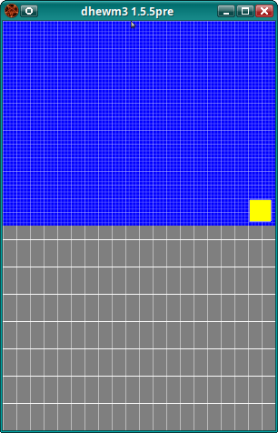

If the screen is wide, anchoring to top-left looks like this:  
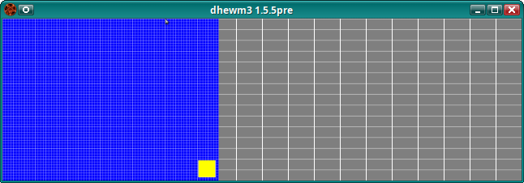

If the screen has 4:3 aspect ratio, anchoring to top-left looks like this:  
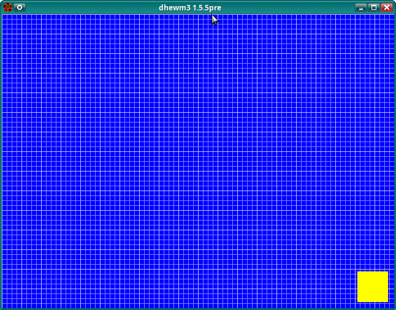

Note how:
* In non 4:3 modes the `Desktop` is stretched (=> its grid isn't square).
* The `AnchorArea` retains its 4:3 aspect ratio and fills as much of the screen (or dhewm3 window)
  as possible without stretching, staying at the *top* or *left* border of the screen, like the name 
  `CST_ANCHOR_TOP_LEFT` suggests.
* The mouse cursor is not stretched either.
* The `URCorner` child of `AnchoredArea` always is where it should be (moves and scales with its parent).
* When the screen has a 4:3 resolution, the `AnchoredArea` has the same size as the `Desktop`
  and covers it completely.
    - This is true for **all** anchor types: A 640x480 windowDef always covers the whole screen if the
      screen has a 4:3 resolution.

All aspect-ratio preserving anchors (as schematics):

* `CST_ANCHOR_TOP_LEFT`:  
  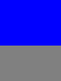 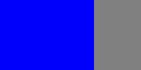
* `CST_ANCHOR_TOP_CENTER`:  
   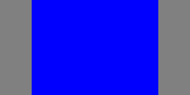
* `CST_ANCHOR_TOP_RIGHT`:  
   
* `CST_ANCHOR_CENTER_LEFT`:  
  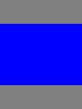 
* `CST_ANCHOR_CENTER_CENTER`:  
   
* `CST_ANCHOR_CENTER_RIGHT`:  
   
* `CST_ANCHOR_BOTTOM_LEFT`:  
  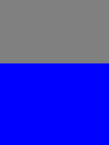 
* `CST_ANCHOR_BOTTOM_CENTER`:  
   
* `CST_ANCHOR_BOTTOM_RIGHT`:  
   

#### Stretching Anchors

These anchors do *not* preserve the aspect ratio of a windowDef, but stretch it over the whole screen,
either horizontally or vertically.  
If it's stretched horizontally, then its height will be the same as it would for an unstretched counterpart
and if it's stretched vertically, its width will be the same as it would be for an unstretched counterpart.

##### Horizontally Stretching Anchors

Here's an example showing both a stretched `CST_ANCHOR_TOP` area and, for comparison, another area
over it that's anchored to the top left corner (in an aspect-ratio preserving way).

```c++
#include "guis/_cst_anchor.pd"
windowDef Desktop {
    scaleto43  0

    rect       0, 0, 640, 480 // cover the whole screen
    backcolor  0.5, 0.5, 0.5, 1 // grey background
    menugui    1 // this is a fullscreen menu
    
    background "gui/grid1" // grid background to show what is and isn't distorted
    naturalmatscale 1 // natural scale so when the windowDef isn't stretched, the grid is square

    windowDef AnchoredArea {
        cstAnchor  CST_ANCHOR_TOP // this area is anchored to the top border of the screen
        rect       0, 0, 640, 480      // cover the whole virtual area
        backcolor  0, 0, 1, 1          // blue background
        background "gui/grid2"  // again a grid (but finer, to easier tell it apart from Desktop grid)
        naturalmatscale 1       // again natural scale

        windowDef URCorner {
            // yellow square in lower right corner of this are
            // (well, it's square when this windowDef isn't stretched)
            rect 580, 420, 50, 50
            backcolor 1, 1, 0, 1 // yellow
        }
    }

    windowDef AnchoredAreaNotStretched {
        // half-translucent full-sized area anchored to top left corner,
        // it's aspect ratio is preserved. will look green on the blue background
        cstAnchor CST_ANCHOR_TOP_LEFT
        rect 0, 0, 640, 480
        backcolor 1, 1, 0, 0.5 // it's half translucent yellow
        // Note: this one doesn't have it's own grid, at this point you hopefully believe
        //       that this kind of anchor preserves the aspect ratio ;)
    }
}
```

Here's what it looks like at different screen aspect ratios:

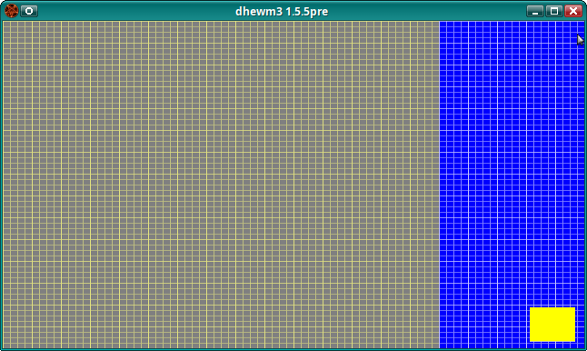 
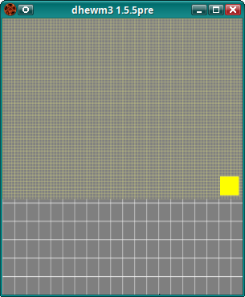 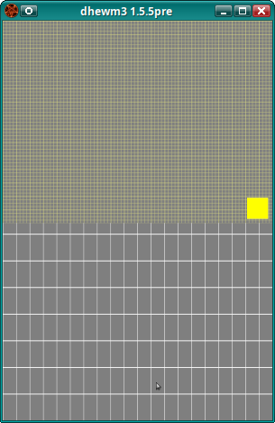 
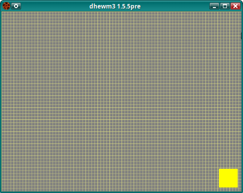

The half-translucent yellow (and thus green) area is the unstretched comparison area that uses
`CST_ANCHOR_TOP_LEFT`, the blue one with the grid (that looks green where covered by the former one)
is the area that uses the stretching `CST_ANCHOR_TOP`.  
As before, the grey area with the bigger grid is the `windowDef Desktop` area that's stretched over
the whole screen.

Note how:

* For wide screen resolutions, `CST_ANCHOR_TOP` behaves just like using no anchor at all:
  It gets stretched horizontally. That's why the grey background is not visible at all
  on the wide screenshot (and the 4:3 screenshot).
* For tall screen resolutions, `CST_ANCHOR_TOP` behaves just like `CST_ANCHOR_TOP_LEFT`
  (or top center or top right): It's a 4:3 area filling the top of the screen (that's why the top area
  is green on those screenshots: The half-translucent yellow area completely covers the blue area).
* Like with all anchors, at 4:3 screen resolutions, a 640x480 `windowDef` using `CST_ANCHOR_TOP`
  fills the whole screen.

When using `CST_ANCHOR_VCENTER` for the blue area (`AnchoredArea`) and `CST_ANCHOR_CENTER_RIGHT`
for the yellow/green area (`AnchoredAreaNotStretched`), it looks like this:

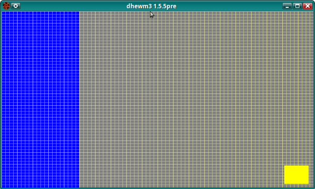 
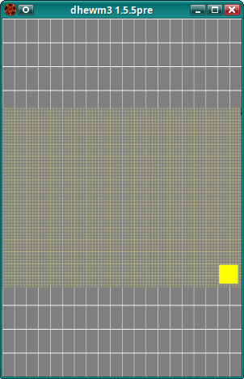

*(Note that the wide version looks a bit different because this time I anchored the unstretched
yellow/green `windowDef` to the right instead of to the left.)*

* For wide screen resolutions, `CST_ANCHOR_VCENTER` just fills the whole screen, stretched horizontally
  (just like `CST_ANCHOR_TOP` and `CST_ANCHOR_BOTTOM` or no anchor at all).
* For tall screen resolutions, `CST_ANCHOR_VCENTER` behaves just like `CST_ANCHOR_CENTER_RIGHT`
  (or `CST_ANCHOR_CENTER_LEFT` or `CST_ANCHOR_CENTER_CENTER`): It's a 4:3 area that uses the full
  width and the height that preserves the 4:3 aspect ratio for that width.
* This means that `CST_ANCHOR_VCENTER` always has the same height and vertical position as the
 `CST_ANCHOR_CENTER_*` anchors *(if their `windowDef` has same the rect...)*, but may be wider.
    - **Generally:** For the same screen resolution, all the aspect-ratio-preserving anchors and the
      anchors that stretch horizontally have the same height if their windowDefs use the same rect.

##### Vertically Stretching Anchors

The remaining anchors (`CST_ANCHOR_LEFT`, `CST_ANCHOR_HCENTER`, `CST_ANCHOR_RIGHT`) stretch vertically.

Example with `CST_ANCHOR_LEFT` for the blue area and `CST_ANCHOR_BOTTOM_LEFT` for the
aspect-ratio preserving yellow/green area with the finer grid - *Note* that the *solid yellow square*
is part/a child of the blue area, though!

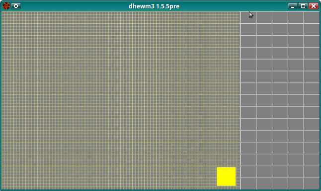 
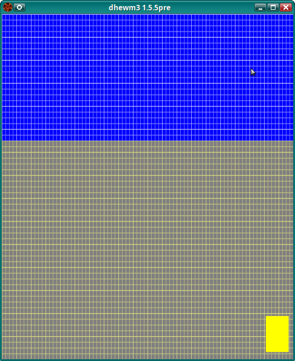

Observations:

* For wide resolutions, `CST_ANCHOR_LEFT` behaves the same as `CST_ANCHOR_BOTTOM_LEFT`
  (or `CST_ANCHOR_CENTER_LEFT` or `CST_ANCHOR_TOP_LEFT`): A 4:3 area that uses the full height and 
  the corresponding width that preserves the aspect ratio, aligned to the left border of the screen.
* For tall resolutions, it has the same *width* as `CST_ANCHOR_BOTTOM_LEFT`, but the *height*
  stretches over the whole screen, looking the same as using no anchor at all.

**Generally:** `CST_ANCHOR_LEFT`, `CST_ANCHOR_HCENTER`, `CST_ANCHOR_RIGHT` use the same width as
the aspect-ratio preserving anchors (that use the same `rect`), but their height is stretched to
use the full height of the screen.

As you probably already guessed, for tall screens `CST_ANCHOR_LEFT`, `CST_ANCHOR_HCENTER` and
`CST_ANCHOR_RIGHT` behave the same, but for wide screen they're anchored to different horizontal
positions (left border, right border or center).

#### Summary for Basic Usage of CstDoom3 Anchors

What has been presented so far already lets you place GUI elements (`windowDefs` or other widgets)
on all parts of the screen, without them getting stretched (or only getting stretched in one direction).

Keep in mind that you always operate in that 640x480 virtual pixel coordinate system, no matter
where your `windowDef` is anchored.  
This means for example that, just like in "classic" Doom3 GUIs, if you want to place a 100x50 rectangle
centered at the right screen border, your `windowDef` needs to use `rect 540, 215, 100, 50`:

* x position `540` because it should start 100 virtual pixels left of the right screen border, which
  has x position 540 (640-100 = 540).
* y position `215` because the virtual height is 480 virtual pixels, so center is at 240 pixels
  and to center that rectangle with height 50 there you have to go 25 pixels up: 480/2 - 50/2 = 215

It's just that, unlike in original Doom3, you can now anchor that to `CST_ANCHOR_CENTER_RIGHT`, so
your rectangle is always at the center of the right border *with the correct aspect ratio*
(i.e. unstretched), no matter what aspect ratio your screen uses.

Some other basic things:

* Don't forget to `#include "guis/_cst_anchor.pd"` at the beginning of your GUI script if you want
  to use the anchors.
    - This also means that you need to make sure you have that file in the first place ;)
* In dhewm3, remember to set `scaleto43 0` in your `windowDef Desktop` if you want to use anchors,
  so you can use the whole screen (no letterboxing).
* You should only set `cstAnchor` in `windowDefs` that are direct children of `windowDef Desktop`.
    - **But** not in the `Desktop` itself!
* All child defs of an anchored `windowDef` (another `windowDef` or `listDef` or `choiceDef` etc)
  are automatically anchored to the same point and scaled in the same way etc, so you can write them
  just like you would in a "classic" Doom3 GUI.
* The `cst_hudAdjustAspect` CVar enables/disables (all) anchoring. In CstDoom3 it's disabled (`0`) by
  default, in dhewm3 it's enabled (`1`) by default. If anchoring is disabled, anchored windowDefs are
  still rendered, but they'll be stretched and positioned just like they would if you hadn't set an anchor.
* In CstDoom3 you can only use anchors for non-interactive GUIs (like the HUD), dhewm3 also allows
  using anchors in fullscreen menus like that main menu, the PDA or the restart window.
* You can easily test your GUIs by entering `testGUI guis/mygui.gui` in the console (adjust the path
  and name of your GUI accordingly). Pressing `Esc` exits it.
* If you have edited your GUI, you don't have to restart Doom3, you can just enter `reloadGuis` in
  the console and they will be reloaded so you can test your latest changes.

### More CstDoom3 Anchor Features

CstDoom3 introduced two more features that I haven't mentioned yet.

#### `cstAnchorTo` and `cstAnchorFactor` for Transitions between Anchors

Two new Window Register variables I haven't mentioned yet are **`cstAnchorTo`** and **`cstAnchorFactor`**.  
To be honest, I haven't used them myself yet so I'll just post the description that *fva*,
the CstDoom3 author, sent us:

> Besides `cstAnchor`, there are two other "Window Register" variables: `cstAnchorTo` and `cstAnchorFactor`.
> These should be used if you want to transition a window smoothly from one anchor to another.
> `cstAnchorTo` is the destination anchor and can be assigned any of the values that can be assigned
> to `cstAnchor`.  
> `cstAnchorFactor` is a number from 0.0 to 1.0 that controls the interpolation between `cstAnchor`
> and `cstAnchorTo`. If `cstAnchorTo` is set to `CST_ANCHOR_NONE` (this is the default), then the
> interpolation scheme is disabled. In CstDoom3, these variables are used to handle the hud
> animations when picking up a pda or video disc, and when a new email is received (like when you
> click on Download on those monitors in Mars City 1).  
> After the interpolation is complete (that is, after you varied `cstAnchorFactor` from 0 to 1),
> you should change `cstAnchor` to the destination value (that is, the value assigned to
> `cstAnchorTo`) and then set `cstAnchorTo` to `CST_ANCHOR_NONE`.

#### `cstNoClipBackground` to Break Out of Parent `windowDef`

The **second** feature is that you can set **`cstNoClipBackground 1`** as "Window Register" variable
of a `windowDef`.  
It allows a `windowDef` to be bigger than its parent, without being cut off at the parent's borders.
This even allows you to use more than 640x480 virtual pixels after all! (Not for the `Desktop` though.)

Virtual pixels still have the same size as before, but for example if your `windowDef` is anchored
to the left border, you could use X coordinates > 640 to render things that will only be visible
in widescreen modes. In fact, it's even possible to use negative X coordinates to enhance the `windowDef`
to the left (more useful when anchored to the right screen border or the center).

**However** you should **_not_ use `cstNoClipBackground`** with windowDefs that
**interact with the mousecursor!**  
The cursor coordinates will be wonky and it probably won't work very well.  
I'd suggest using `cstNoClipBackground 1` only together with `noevents 1`.

I think it's still very useful for backgrounds and similar non-interactive elements of the GUI.
In fact, what would be the point in using it for interactive ones - buttons etc tend to be a lot
smaller and are better suited to be anchored to specific locations.

But then again - this could be a lot more useful if we knew the aspect ratio or screen size, right?  
This leads us to the next chapter..

### dhewm3 Extensions for the Anchor System

Two changes that don't need much explaining are that in dhewm3, unlike in CstDoom3, you can use
anchors in interactive GUIs (that have clickable buttons etc) and that anchored renderDefs have the
correct aspect-ratio.

#### New GUI Variables for Anchoring

Another change is that there are some new GUI variables that are set (and updated) from the engine
code based on the current screen resolution:

* `gui::cstAspectRatio`: The screen aspect ratio (for 16:9 it's 16/9 = 1.7777).
* `gui::cstWidth`: The screen width in unstretched **virtual** pixels.
    - For aspect ratios **wider** than 4:3, it's `480 * gui::cstAspectRatio`, otherwise just `640`.
* `gui::cstHeight`: The screen height in unstretched **virtual** pixels.
    - For aspect ratios **narrower** than 4:3, it's `640 / gui::cstAspectRatio`, otherwise just `480`.
* `gui::cstHorPad`: The horizontal padding between the left or right screen border and a 640x480 
  `windowDef` anchored to `CST_ANCHOR_CENTER_CENTER`. It's just `(gui::cstWidth - 640)/2`,
  provided for convenience.
    - For tall screen resolutions, it's `0`.
* `gui::cstVertPad`: The vertical padding between the top or bottom screen border and a 640x480
  `windowDef` anchored to `CST_ANCHOR_CENTER_CENTER`. It's just `(gui::cstHeight - 480)/2`,
  provided for convenience.
    - For widescreen resolutions, it's `0`.

A nice thing about Doom3 GUIs is that you can use these variables in windowDefs, and those
will be updated automatically when the variable changes (well, at least for the `rect`, didn't test
it for anything else).  
With this you can do neat things like this:

```c++
#include "guis/_cst_anchor.pd"
windowDef Desktop {
    rect       0, 0, 640, 480 // cover the whole screen
    scaleto43  0             // no letterboxing
    backcolor  0, 0, 0, 1    // black, or whatever
    menugui    1

    windowDef BackGround {
        cstAnchor  CST_ANCHOR_TOP_LEFT
        rect       0, 0, "gui::cstWidth", "gui::cstHeight"
        cstNoClipBackground 1 // so this windowDef can actually be > 640x480..
        noevents            1 // .. which means it should take no events

        // set a texture that tiles (repeats endlessly and seamlessly in both directions)
        background "gui/grid1"

        // this makes the texture repeat based on its size (in real pixels)
        // and the windowDefs size (in virtual pixels),
        // preserving the textures aspect ratio
        naturalmatscale 1
    }

    // ... your other windowDefs with buttons and whatever else your GUI needs
}
```

This sets an unstretched(!) background texture over the whole screen, repeating as aften as
necessary to fit the screen. Wouldn't have been possible without the new variables and CstDoom3's
anchor system!

Another usecase is to display things only in the "letter-box" bars, if you anchor the main part
of your menu to the center (especially useful when modifying existing comples GUIs, like the Doom3
mainmenu, to be widescreen-friendly). For example, if your existing menu has a half-translucent
grey bar on the bottom of the centered area (kinda like the doom3 main menu...), and you want to
continue that to the borders of the screen, you could add something like:

```c++
  windowDef LowerGreyBarLeft {
      cstAnchor CST_ANCHOR_CENTER_LEFT
      // assuming the position is 400 virtual pixels down
      // and it should be 40 virtual pixels high
      rect      0, 400, "gui::cstHorPad", 40

      // in case the screen is so wide that the left bar
      // is wider than 640 virtual pixels
      cstNoClipBackground 1
      // no events with cstNoClipBackground; this is just for optics anyway
      noevents            1
      backcolor 0.6, 0.6, 0.6, 0.2 // or whatever color
  }

  windowDef LowerGreyBarRight {
      cstAnchor CST_ANCHOR_CENTER_RIGHT
      // again, 400 virtual pixels down, 40 virtual pixels wide
      rect      640 - "gui::cstHorPad", 400, "gui::cstHorPad", 40

      cstNoClipBackground 1 // stretch as wide as needed
      noevents            1
      backcolor 0.6, 0.6, 0.6, 0.2 // or whatever color
  }
```

If the screen has an aspect ratio of 4:3 or narrower (taller), `"gui::cstHorPad"` will be `0`
and those windowDefs will be invisible.

Also note how you can't only use the variable in the rect, but even do calculations with it,
like `640 - "gui::cstHorPad"`! Pretty cool IMHO (and Doom3 already supported this, dhewm3 only
added new variables).

#### New Named Event CstScreenSizeChange

Related to the new variables, dhewm3 adds a new Named Event `CstScreenSizeChange` that gets
called whenever the variables are updated (i.e. the screen/Doom3 window has been resized or
resolution switched).  
Note that it does not get called before (or when) the GUI is opened/activated, but only if the
screen size changes while the GUI is opened.  
You can use it if you want to do specific things when the aspect ratio has changed, that can't be
handled by just the automatically updated `windowDef` `rect` using the variables.

Example:

```c++
  onNamedEvent CstScreenSizeChange {
      set "print" "Called CstScreenSizeChange - Width:" "gui::cstWidth" "Height:" "gui::cstHeight";
      // and show or hide elements or whatever you want to do here
  }
```

#### Debug Printing from Scripts into Doom3 Console

Oh right, this **debug printing function** with `set "print"` has also been added to dhewm3, it will
print lines like  
`GUI debug: Called CstScreenSizeChange - Width: 768.000000 Height: 480.000000`  
to the Doom3 Console (and dhewm3log.txt).

It can be used in event handlers (all those `onWhatever` things like `onActivate`, `onAction` etc)
and can have an arbitrary number of arguments of any kind (literals, variables,windowDef properties, ...)
or type (strings, floats, rects, colors, vec4, ...).
Example:

```c++
#include "guis/_cst_anchor.pd"
windowDef Desktop {
    rect       0, 0, 640, 480
    scaleto43  0
    menugui    1
    backcolor 0.5, 0.5, 0.5, 1
    
    windowDef SomethingAnchored {
        // just a blue rect that's always 20 virtual pixels from the borders
        cstAnchor  CST_ANCHOR_TOP_LEFT
        rect       20, 20, "gui::cstWidth" - 40, "gui::cstHeight" - 40
        cstNoClipBackground 1
        noevents   1
        backcolor  0, 0, 1, 1
    }

    windowDef Button {
        cstAnchor  CST_ANCHOR_CENTER_CENTER
        rect 100, 50, 200, 50
        backcolor  1, 0, 0, 1
        text "Click me!"

        onAction {
            set "print" "Just some string, now a number:" 42 "blue rect:" "$SomethingAnchored::rect"
                "aspectratio:" "gui::cstAspectRatio" "my color:" "$backcolor";
        }
    }
}
```

Which, when clicking the button, prints something like:  
`GUI debug: Just some string, now a number: 42 blue rect: 20 20 728 440 aspectratio: 1.600000 my color: 0.5 0.5 0.5 1`

#### Using `naturalmatscale` with `matscalex` and `matscaley`

So far one could only use *either* `naturalmatscale` *or* `matscalex`/`matscaley`.

`"naturalmatscale 1"` lets a texture repeat in its native size, so if you have a 64x32 texture
and a 320x160 windowDef, it will be repeated 5 times in each direction.  
If you resize the windowDef to 384x160, it will repeat the texture 6 times horizontally
(and still 5 times vertically).

In dhewm3 1.5.5 *(or current git..)*, `matscalex`/`matscaley` allow scaling that texture.  
If both values are set to 2, (and `naturalmatscale` to `1`) the 64x32 texture in a 384x160 windowDef
will be repeated 12 times horizontally and 10 times vertically, at half the size per direction.  
*Without* `naturalmatscale` it would be repeated 2 times in each direction, no matter how big
the windowDef is.

### Hints for Making Existing GUIs Widescreen-Compatible

* If you have a complex 4:3 GUI (like Doom3's main menu) it's quite possible that it would be
  very hard to make it actually use the whole screenspace, especially interactive stuff like buttons.  
  **Just anchor them to the center** (`CST_ANCHOR_CENTER_CENTER`) and extend only the background to the
  sides (or top/bottom).  
  It's easiest if you can just put everything (except for the background) in one new
  `windowDef CenteredMainArea {...}` that's anchored to the center, but sometimes that's not really
  feasible because for example event handlers interact with the background (or event handlers in the
  Desktop interact with the stuff that are now in the new `windowDef CenteredMainArea`) and fixing
  them all up to use the correct names (for example with `CenteredMainArea::` prepended) would
  be too much work. In that case anchor the required top level ones individually.
* If the **mouse cursor looks stretched** *(I think it can happen if the last windowDef isn't anchored?)*,
  it helps to put an otherwise empty windowDef at the end of the GUI (last element of
  the Desktop) and anchor it to the center (or some other aspect-ratio-preserving point), like:  
  ```c++
  windowDef FakeDesktop {
      rect 0, 0, 640, 480 // full size
      cstAnchor	CST_ANCHOR_CENTER_CENTER // anchored
      // otherwise empty
  }
  ```
